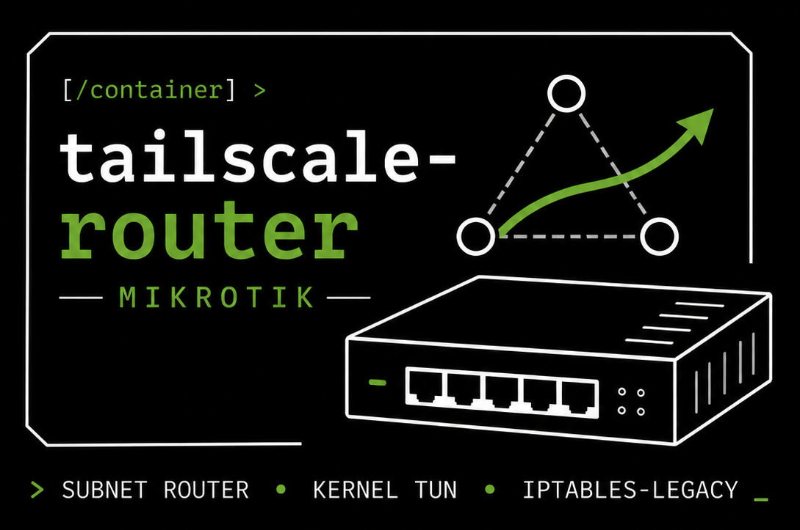
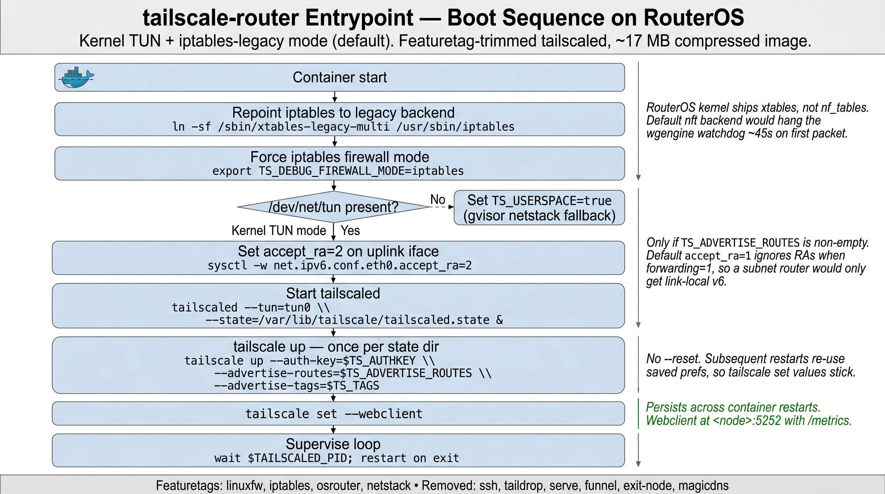
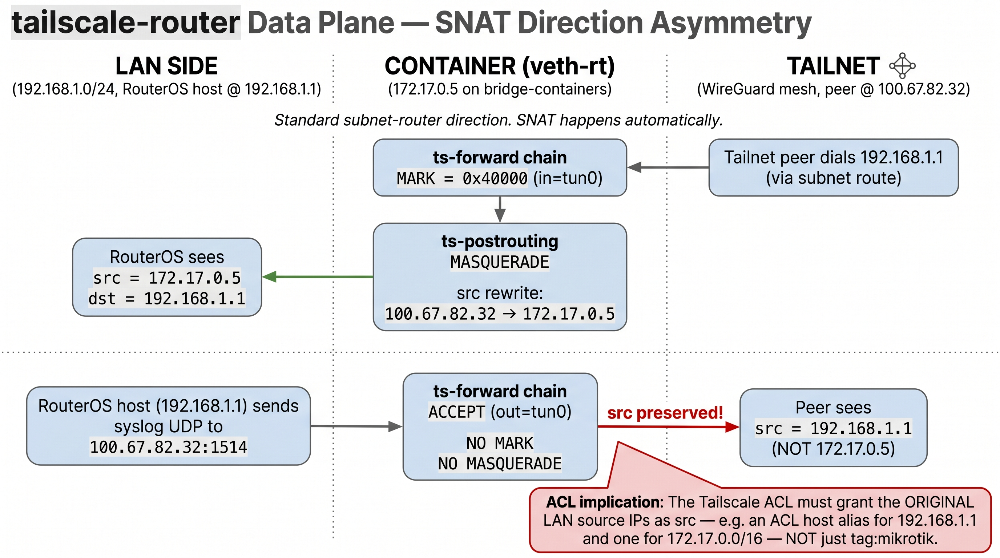

<p align="center">
  
</p>

A minimal Tailscale subnet-router OCI image purpose-built for **MikroTik
RouterOS containers** — kernel TUN, iptables-legacy, persistent webclient,
trimmed via featuretags. Ships as a docker-archive `.tar` you load on
the router via `/container/add file=...`.

Originally built to replace
[`fluent-networks/tailscale-mikrotik`](https://github.com/Fluent-networks/tailscale-mikrotik)
on an RB3011 home gateway, but the patterns generalize to any RouterOS
device that supports `/container` (7.4+).

For background on running Tailscale on resource-constrained devices,
see Tailscale's official guide
[**Set up a small Tailscale device**](https://tailscale.com/docs/how-to/set-up-small-tailscale).
The trimming-via-featuretags approach used here is informed by that
doc, scaled down further for the RB3011's flash budget.

## Why a custom image?

A few RouterOS-specific quirks make the third-party
[`tailscale-mikrotik`](https://github.com/Fluent-networks/tailscale-mikrotik)
image and the upstream
[`tailscale/tailscale`](https://github.com/tailscale/tailscale) image
less than ideal:

- **Persistent prefs.** `fluent-networks/tailscale-mikrotik`'s entrypoint
  runs `tailscale up --reset` on every boot, which wipes anything set via
  `tailscale set` — including `--webclient`. This image runs `tailscale
  up` once and uses `tailscale set` for ongoing prefs, so the web UI /
  `/metrics` endpoint persists across container restarts.
- **iptables-legacy required.** The RouterOS kernel ships xtables but
  **not** `nf_tables`. tailscaled defaults to nftables on modern kernels
  and hangs the wgengine watchdog (~45 s) on first packet because nft
  syscalls return `ENOTSUP`. The entrypoint repoints `/usr/sbin/iptables`
  at `xtables-legacy-multi` and forces `TS_DEBUG_FIREWALL_MODE=iptables`
  so tailscaled uses the available toolchain.
- **No SLAAC for forwarders.** Containers that enable IPv6 forwarding
  (subnet routers do) won't accept Router Advertisements from the bridge
  unless `accept_ra=2` is set. The entrypoint handles this when
  `TS_ADVERTISE_ROUTES` is non-empty.
- **Trimmed via featuretags** — drops SSH, Taildrop, Serve, Funnel,
  exit-node features; keeps `linuxfw`, `iptables`, `osrouter`, `netstack`.
  Final compressed image is ~17 MB; uncompressed docker-archive ~16 MB.
- **Bind-mountable entrypoint.** RouterOS lets you mount a single file
  over the container's entrypoint, so iteration on entrypoint logic
  doesn't require rebuilding the image. Push the new `entrypoint.sh` to
  `/usb1/...` on the router, restart the container, done.

The actual boot sequence (kernel-TUN happy path):

<p align="center">
  
</p>

## Layout

```
.
├── Dockerfile         # multi-stage: trimmed Tailscale build + Alpine runtime
├── entrypoint.sh      # tailscaled supervisor with persistent --webclient
├── build.sh           # buildx + skopeo → docker-archive .tar
├── compose.yaml       # local arm/v7 test harness (QEMU on macOS)
├── deploy.rsc         # RouterOS /import script (example for an RB3011)
├── LICENSE            # MIT
└── README.md
```

## Pre-built image

Multi-arch (`linux/arm/v7` + `linux/arm64`) images are published to
Docker Hub on every push to `main` and on each `v*` tag, via
[`.github/workflows/build.yml`](.github/workflows/build.yml). Pull
directly with:

```bash
docker pull <dockerhub-namespace>/tailscale-router-mikrotik:latest
# or pin to a release:
docker pull <dockerhub-namespace>/tailscale-router-mikrotik:1.96.5
```

For the on-router deploy, `skopeo copy docker://...` to a
`docker-archive:tailscale-router.tar` then scp to the router (same
flow as `build.sh` produces locally).

## Building locally

Requires Docker (with buildx) and either `skopeo` (recommended; produces
a docker-archive that RouterOS can load directly) or the
containerd-image-store flag enabled.

```bash
./build.sh
# → tailscale-router.tar  (~16 MB, linux/arm/v7 by default)
```

Cross-build for a different RouterOS architecture:

```bash
PLATFORM=linux/arm64 ./build.sh
```

Pinned versions live at the top of `build.sh`:

| Variable             | Default   | Notes |
|----------------------|-----------|-------|
| `TAILSCALE_VERSION`  | `1.96.5`  | Matches upstream tag; the build pulls source from GitHub. |
| `GO_VERSION`         | `1.26.1`  | Must match the `go.mod` of the chosen Tailscale tag. |
| `ALPINE_VERSION`     | `3.22`    | Runtime base. |
| `PLATFORM`           | `linux/arm/v7` | RB3011 is ARMv7. RB5009/CHR is `linux/arm64`. |

When you bump `TAILSCALE_VERSION`, re-check upstream's `go.mod` and bump
`GO_VERSION` to match — Tailscale tracks new Go releases tightly and a
stale Go can break the build with `undefined: <newer stdlib symbol>`.

## Local testing

The `compose.yaml` runs the same image under QEMU emulation on a dev
machine (Apple Silicon or x86), so you can validate entrypoint changes
before flashing the router.

```bash
# 1. Generate a Tailscale auth key with tag:mikrotik in the admin console:
#    https://login.tailscale.com/admin/settings/keys
#    Reusable: NO   Ephemeral: NO   Tags: tag:mikrotik
echo "TS_AUTHKEY=tskey-auth-..." > .env   # never commit

# 2. Bring it up
docker compose up --build

# 3. From another shell, confirm tailscaled is happy and webclient stuck
docker compose exec tailscale-router \
    tailscale --socket=/var/run/tailscale/tailscaled.sock status

docker compose exec tailscale-router \
    tailscale --socket=/var/run/tailscale/tailscaled.sock debug prefs \
    | grep -i web
```

## On-router deployment

`deploy.rsc` is an idempotent `/import` script that creates the veth,
bridge port, mount, and `/container` entry. **The IPs and MAC addresses
in there are the values from the original RB3011 deployment** — they
are illustrative, not authoritative. Adjust the `address=`,
`gateway=`, `mac-address=`, and `container-mac-address=` for your
topology before importing.

```bash
# 1. Build the image archive locally
./build.sh

# 2. SCP onto the router (paths are examples — anywhere persistent works)
scp -p tailscale-router.tar       <user>@<router>:/usb1/container-images/tailscale-router.tar
scp -p entrypoint.sh              <user>@<router>:/usb1/tailscale-router-entrypoint.sh
scp -p deploy.rsc                 <user>@<router>:tailscale-router-deploy.rsc

# 3. /import on the router (after editing deploy.rsc to match your topology)
ssh <user>@<router> '/import file-name=tailscale-router-deploy.rsc'

# 4. Set the auth key (don't bake into the image)
ssh <user>@<router> '/container envs set [find list=tailscale-router and key=TS_AUTHKEY] value="tskey-auth-..."'
ssh <user>@<router> '/container start [find name=tailscale-router]'
```

The container's entrypoint is bind-mounted from
`/usb1/tailscale-router-entrypoint.sh` — to iterate on entrypoint
behaviour without rebuilding the image, edit locally, `scp -p`,
`/container stop` + `start`.

## Configuration

Set via the container's envlist:

| Env var               | Required | Notes |
|-----------------------|----------|-------|
| `TS_AUTHKEY`          | yes      | Pre-auth key from the Tailscale admin console. |
| `TS_AUTH_ONCE`        | no       | `true` (default) — only auth once per state directory. |
| `TS_HOSTNAME`         | no       | Tailnet hostname; defaults to the container's hostname. |
| `TS_ADVERTISE_ROUTES` | no       | CIDR list to advertise as subnet routes (e.g. `192.168.1.0/24`). Empty = parked. |
| `TS_TAGS`             | no       | Comma-separated list (e.g. `tag:mikrotik`). |
| `TS_PORT`             | no       | Magicsock UDP port (default `41641`). |
| `TS_USERSPACE`        | no       | `true` forces gvisor netstack mode (used for `compose.yaml`; on RouterOS leave unset for kernel TUN). |

## Data plane

Tailscale's `ts-postrouting` chain MASQUERADEs traffic going *inbound*
on `tun0` (tailnet → subnet — the canonical subnet-router direction)
but **not** the reverse. Outbound traffic from the router or from LAN
clients pre-routed through the container leaves `tun0` with the
**original source IP intact**. That means tailnet peers see the LAN
source IPs (e.g. `192.168.1.1` or `172.17.0.x`), not the container's
tailnet IP. Your Tailscale ACL has to grant those original IPs as
sources — usually via host aliases — not just `tag:mikrotik`.

<p align="center">
  
</p>

## Featuretag rationale

The Dockerfile builds tailscaled with `--add=linuxfw,iptables,osrouter,netstack`
and `--remove=` for everything else. Each tag is documented inline; the
short version:

- `linuxfw` — netfilter integration (required for subnet routes to work).
- `iptables` — same. Without it tailscaled uses nft on modern kernels and hangs.
- `osrouter` — kernel TUN forwarding paths (subnet-router mode).
- `netstack` — userspace fallback (kept so `TS_USERSPACE=true` works for local testing).
- Removed: SSH, Taildrop, Serve, Funnel, exit-node, magicdns. None of these are useful on a parked subnet router and they pull in a lot of code.

## Known issues

- **Stale tailnet identity after image rebuild.** If you change
  `hostname` or rebuild without preserving `_state/`, the new container
  re-registers as a fresh tailnet device and the old one shows as
  offline in the admin console. Either delete the stale device or
  preserve the state directory across rebuilds.
- **PD rotation breaks static IPv6 on the veth.** If your bridge gets
  its IPv6 from DHCPv6-PD and the prefix rotates (PPPoE redial / cold
  boot), a hard-coded v6 on the veth goes stale. Either hand off v6 to
  SLAAC (works as long as the container does not enable v6 forwarding)
  or run a host-side reconciler that rewrites the veth's v6 on PD
  changes.

## License

[MIT](LICENSE) — Copyright (c) 2026 Rodney Hawkins.

The build pulls Tailscale source from upstream at the pinned tag;
Tailscale itself is BSD-3-Clause. Alpine packages used in the runtime
stage carry their respective upstream licenses.
